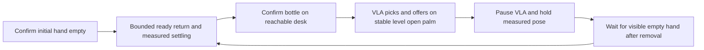

# Bottle handover target and dataset inspection, 9 October 2026

The active development target is a standing G1 handing a bottle across a desk
to a person, then returning its empty hand to a handshake-ready pose and
repeating. See the [approved design](../../superpowers/specs/2026-10-09-g1-bottle-handover-autopilot-design.md).

## Dataset

Input: `/home/jihun/work/GR00T-WholeBodyControl/outputs/handover_bottle_260930`.
Resolved input: `/mnt/data/jihun/datasets/G1_WBT_GR00T/handover_bottle_260930`.

| Check | Observed result |
|---|---|
| Episodes / ego videos | 61 / 61 |
| Frames | 30,035, or 600.7 s at 50 fps |
| Camera dimensions | Metadata declares 640 × 480 RGB |
| Video/parquet alignment | All 61 have matching counts and 50 fps |
| State / end-effector / token dimensions | 43 / 14 / 64 |
| Finite state and motion tokens | Pass across all episodes |
| Largest absolute motion token | 0.5625; current native bound is 1.25 |
| Current task label | `place OBJECT on the table`, task index 0 on every row |
| Held-out split | None; original metadata declares train `0:61` |
| Accepted handover segments | 0 |
| User-confirmed reference episodes | 15 and 30 |
| User-confirmed failed offering | 16: bottle rolls off tilted open palm; human rescue |

[Numeric audit](numeric-audit.json) records per-episode counts, dimensions,
control fields and hashes for the inspected source metadata, parquet and video
files. No source data or labels have been changed. The checks cover the stated
columns; they do not prove every teleoperation field is valid or that any
episode is a successful full cycle.

Stream-mode row counts are 29,433 for value 1, 270 for value 2 and 332 for
value 3. Episodes 2, 3, 23 and 59 contain mode values other than 1 and need
control-mode review before selecting training windows. This audit does not
assign semantic meanings to those integers. Planner movement vectors are
zero throughout and the recorded speed field is -1 throughout; these are
commands/parameters, not measured proof of stationary feet.

## Sampled visual review

Eight uniformly spaced frames were inspected from each of six episodes.
Dense terminal sampling was then inspected for episodes 15 and 30. The
selected frame coordinates are in [sampled-review.json](sampled-review.json).
These samples are preliminary review evidence, not accepted cuts or labels.

| Episode | Sampled observation | Next review |
|---|---|---|
| [0](episode_000000.jpg) | Human supplies bottle, robot picks and offers it | Exclude initial setup; check terminal handover/ready return in full video |
| [15](episode_000015.jpg) | Pickup, sideways open-palm offer, person removes bottle | Promising offering/removal reference; [dense terminal views](episode_000015_terminal.jpg) show empty palm at frames 415–431, only 0.34 s of frames |
| [16](episode_000016.jpg) | Tilted open palm lets bottle roll off; person rescues it | [Dense incident views](episode_000016_terminal.jpg), sampled bracket [335,361); exclude from positive handover training |
| [30](episode_000030.jpg) | Pickup and offering; recording ends while person removes bottle | [Dense terminal views](episode_000030_terminal.jpg); no observed subsequent settled ready pose |
| [45](episode_000045.jpg) | Human desk/bottle setup in sampled views | Do not auto-label as a successful robot handover |
| [54](episode_000054.jpg) | Human repositions bottle during the episode | Review full attempt and recovery before assigning an outcome |
| [60](episode_000060.jpg) | Early bottle interaction, then changing camera/workspace view | Identify relevant interval and exclude unrelated tail if confirmed |

The active movement appears to use the right hand; the recorded right-arm
span in the reviewed episodes supports that reading. Palm orientation and
object support are visual judgments here, not calibrated wrist transforms.
The user confirmed **15 and 30** when asked for the best complete-cycle
references, including ready return. Their choice establishes the intended
examples. Episode 15's visible empty-hand ending is the candidate ready-pose
reference; the recorded joints can supply its numeric target. It still needs
a validated return path and measured settling. The sampled inspection alone
does not establish a continuous ready-return motion, particularly in episode
30's recorded ending.

[Candidate ready target](ready-pose-candidate.json) contains named right-arm
and hand joint values derived from the median measured state at episode 15
frames 415–431. The largest right-arm joint span there is 0.00971 rad. This
short 0.34-second interval is below the native reset's 0.5-second settle dwell;
it supplies a target candidate, not a passed settling test or an actuator
command. The implementation maps seven named right-arm joints to motor order
and checks the native XML limits. It uses the existing all-zero open-right-hand
preset rather than copying the dataset’s differently ordered measured hand
array. The physical return path and palm calibration remain unverified.

## Implemented handover loop

The software implements one ownership session across repeated cycles:



Two distinct fresh affirmative camera frames are required for each perception
transition. Occlusion or a still-held bottle keeps the robot waiting. An
observed roll/drop/rescue latches failure for the cycle; subsequent empty-hand
evidence cannot repair it. Failure, expired observations, lost ownership or
cancellation stop the session. The offering image remains available across
the paused epoch as context; only fresh paused frames confirm removal.

`reset_ready` preserves the measured waist, other arm, left hand and heading.
It opens the right hand and approaches the named right-arm target at no more
than 0.5 rad/s and 0.15 rad ahead of measurements. Tracking compensation is
clipped to the right-arm joint limits. Completion requires measured settling
within 0.05 rad for 0.5 seconds; the deadline remains 15 seconds.

The [implementation plan](../../superpowers/plans/2026-10-09-g1-bottle-handover-autopilot.md)
links the changed interfaces and tests. The old placement profile is unchanged.
The new [example profile](../../../configs/g1/handover.example.yaml) is disabled:
its handover checkpoint and ready-path review flags are false. Registering the
prompt does not establish that a model can execute it.

The CLI now accepts `autopilot --max-cycles 3`; omit the limit to repeat until
cancellation. Use the same reviewed profile in VoLoAgent and the native
executor; the strict status schema changed, so both must be updated together.
The CLI accepts an exported `GENON_API_KEY` (or `--vlm-api-key`), with
`--vlm-model openai/gpt-5.6-sol --vlm-base-url https://api.genon.ai/v1`.
A key stored in `.env` must first be loaded into the launching shell's
environment. Credentials are absent from committed artifacts.

## Remaining acceptance work

1. Review exact positive pickup-to-stable-offer cuts from episodes 15/30 and
   other suitable sources. Reserve episode 16 as failure evidence; do not
   train it as a successful offering. Assign whole source episodes to
   train/validation/test before producing action windows.
2. Replace the generic `place OBJECT on the table` labels in a derived dataset
   with the exact trained pickup-and-offer instruction, train a handover VLA,
   and verify the actual serving checkpoint and disconnected policy replay.
3. Score the recorded success, roll/rescue, removal and occlusion cases using
   the requested Genon vision endpoint. Measure latency against offer dwell;
   sparse images can miss a fast roll, even with retained context.
4. Validate palm orientation and stable bottle support, the ready-return path,
   and desk/person clearance in SONIC simulation before supervised hardware
   acceptance. The current checks do not prove those physical properties.

No source dataset was changed, no policy/vision endpoint was queried and no
physical robot command was sent. The IPC tests use synthetic measurements,
blank camera images, scripted vision replies and a memory-only publisher.
They establish software control flow and contracts, not policy or perception
competence. GPU training and new-target physical simulation have not run.

## Verification

The inspection used `/home/jihun/work/Isaac-GR00T/.venv/bin/python`, PyArrow,
NumPy, OpenCV and the workstation's `ffprobe`. The following read-only check
reproduces the core all-episode alignment and state/token checks:

```bash
/home/jihun/work/Isaac-GR00T/.venv/bin/python - <<'PY'
from pathlib import Path
import json, subprocess
import numpy as np
import pyarrow.parquet as pq

root = Path('/home/jihun/work/GR00T-WholeBodyControl/outputs/handover_bottle_260930')
files = sorted(root.glob('data/chunk-*/*.parquet'))
rows, token_bound = 0, 0.0
for path in files:
    table = pq.read_table(path)
    assert table['frame_index'].to_pylist() == list(range(table.num_rows))
    for name, width in [('observation.state', 43), ('action.motion_token', 64)]:
        values = np.asarray(table[name].to_pylist())
        assert values.shape == (table.num_rows, width) and np.isfinite(values).all()
        if name == 'action.motion_token':
            token_bound = max(token_bound, float(np.max(np.abs(values))))
    video = root / 'videos/chunk-000/observation.images.ego_view' / (path.stem + '.mp4')
    args = ['ffprobe', '-v', 'error', '-select_streams', 'v:0', '-show_entries',
            'stream=r_frame_rate,nb_frames', '-of', 'json', str(video)]
    result = subprocess.run(args, capture_output=True, text=True, check=True)
    stream = json.loads(result.stdout)['streams'][0]
    assert stream['r_frame_rate'] == '50/1' and int(stream['nb_frames']) == table.num_rows
    rows += table.num_rows
assert len(files) == 61 and rows == 30035 and token_bound == 0.5625
print(len(files), rows, token_bound)
PY
```

Expected output: `61 30035 0.5625`. Source hashes were rechecked for all 126
inspected input files. Ten contact sheets contain 96 sampled frames with
valid source bounds. An independent standards/specification review found no
confirmed material defects in the earlier proposal/report. A separate runtime
review identified three Important findings: cached phase-entry frames, ready
tracking compensation outside joint bounds, and discarded offering context.
Each was reproduced by a failing test and fixed; no second review is claimed.

[Verification record](verification.json) binds the report files and records the
inspection scope. [Software verification](runtime-verification.json) records
the test commands, results and native full-suite dependency gaps. Simulation,
trained policy and hardware acceptance remain pending.
