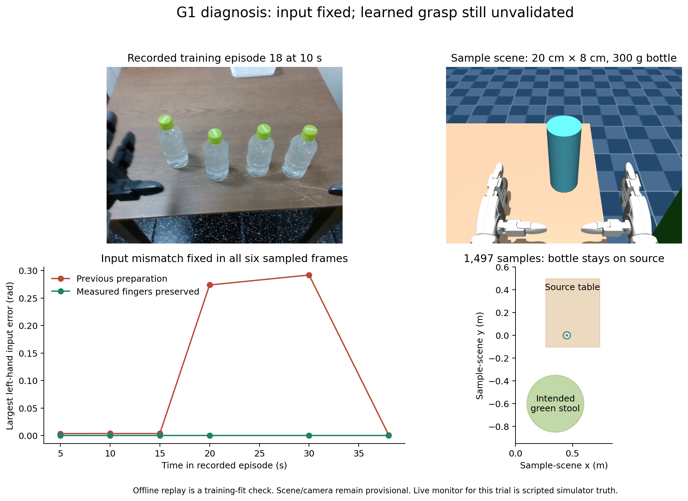
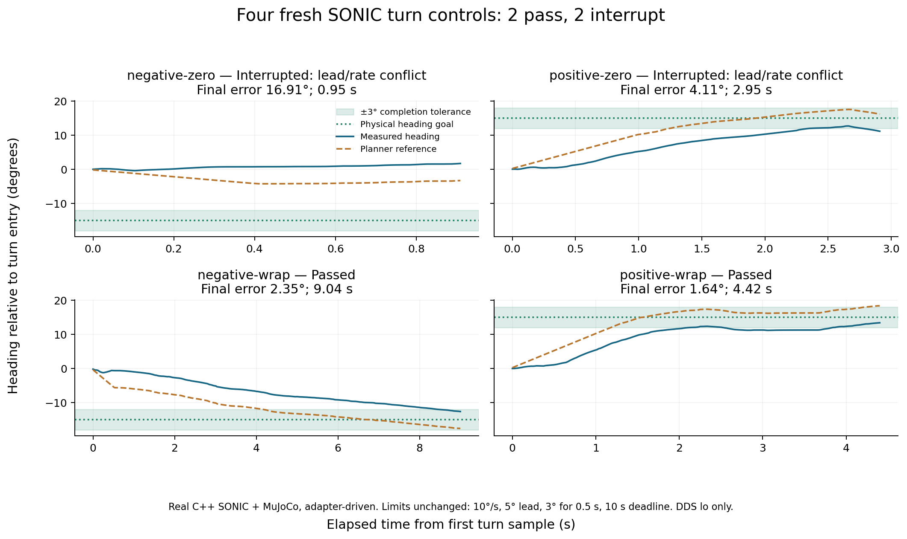

# G1 input, bottle and turning investigation — 2026-10-06

The live VLA input now preserves the finger measurements used during training.
The sample bottle matches the user's measurements: 20 cm tall, 8 cm in diameter,
and 300 g. The real checkpoint still did not grasp it in the sample simulation.
Turning also remains inconsistent: two fresh cases passed and two interrupted.
Hardware acceptance and task 8 remain open.

VoLoAgent can choose a registered task, watch progress, stop VLA, and request a
standing reset. In everyday terms, the supervisor can manage the job, but the
worker still has to learn or reproduce the physical task in the scene it sees.
Only one manipulation instruction is registered for this checkpoint:

```text
pick drink bottle and place it on the right table
```

New manipulation subgoals need demonstrated and evaluated policy support.
Existing SONIC standing, walking and turning skills use procedural controls;
they do not require additional VLA language prompts. Standing reset preserves
the heading at reset entry. Returning to an earlier floor location still needs
localization and navigation.

[Machine-readable results](validation-summary.json),
[input comparison](policy-analysis/input-comparison.png),
[bottle diagnosis](bottle-diagnosis.png), and [turn traces](turn-repeat.png).
Each figure also has a PDF beside it. These are saved experiment plots;
the requested monitoring dashboard remains deferred to another session.



## Measured observations

`prepare_observation_from_sensors` previously copied the left index-finger
readings into the middle-finger entries and mutated the cached sensor message.
The training exporter retained the independently measured values. The native
fix removes that overwrite; it leaves the joint and action ordering intact.
Hand action labels use motor-order teleoperation fields, while observation
groups use the robot model's group order. Those mappings agree with the dataset.

Six samples from successful source episode 18, at 5, 10, 15, 20, 30 and 38 s,
now match all eight training state groups exactly. Before the fix, the largest
left-hand mismatch in those samples was 0.291843 rad. The regression test also
checks that the cached measurements and RGB image remain unchanged.

Across all 274,241 retained frames, the previous overwrite would alter a finger
reading by more than 0.1 rad in 76,199 frames, with a maximum difference of
1.448620 rad. This establishes a real input mismatch. It does not establish
that the mismatch caused the failed grasp: corrected live trials also failed.

[Before-fix replay](policy-replay/result.json) and
[after-fix parity](measured-state-parity/inputs.json) preserve their original
hashes and paths. Their probe snapshots were reconstructed and checked against
the source hashes captured at execution; both match exactly.

## Checkpoint replay and scene sensitivity

Thirty real checkpoint queries completed with finite native action shapes:
`[1,40,64]` motion tokens and two `[1,40,7]` hand arrays. The first query took
4.803 s; the remaining 29 averaged 0.133 s. No controller or action socket was
opened by this replay probe.

The 18 chunks using six recorded inputs had mean absolute errors against
recorded targets of 0.02637 for motion tokens, 0.00208 rad for the left hand,
and 0.00237 rad for the right hand. Episode 18 is part of training, so this is
a training-fit check, not a held-out success estimate.

| Input comparison at recorded 10 s | Motion-token mean absolute difference |
| --- | ---: |
| Same input, repeated sampling | 0.01650 |
| Previous native preparation | 0.01668 |
| Replace image with saved simulation image | 0.05867 |
| Replace state with saved simulation state | 0.02432 |
| Replace both image and state | 0.15582 |

These exploratory comparisons use three repeats, one training episode and one
saved monitor JPEG. The simulation state comes from its nearest 10 Hz saved
sample, about 5 ms earlier than the image. It is an approximate reconstruction,
not the exact original policy request. Changing the image also changes the
visible robot pose, objects and camera view; the experiment does not isolate
bottle appearance or prove a cause of failure. The overwrite is small at the
chosen 10 s input, which explains why that particular comparison is close to
the repeated-sampling baseline.

## Bottle measurements and fresh live trials

The previous cylinder was 15 cm tall, 6 cm in diameter and about 42 g.
[The new layout](scene_layout_bottle_measured.json) changes its collision size
and mass to 20 cm, 8 cm and 300 g. Table positions, camera, friction and cyan
appearance are held fixed for this physical-parameter comparison. Its uniform
cylinder density is 298.416 kg/m³; mass matches, but the real bottle's shape and
mass distribution remain approximate.

Both sample surfaces are 80 cm high. The source center is `(0.5, 0.2)` m and
the stool center is `(0.35, -0.6)` m in scene coordinates. Those positions are
the existing sample layout, not the user's approximate full workstation
measurements. Appearance still differs visibly from the clear bottles with
green caps in the recording. Whole-scene calibration remains false.

| Trial after input fix | Monitor | Time from skill start | Object samples | Result |
| --- | --- | ---: | ---: | --- |
| Original sample bottle | Genon GPT-5.6 Sol | 61.61 s | 935 | 24 in-progress decisions, then unavailable monitor; interruption |
| Original sample bottle | Scripted simulator truth | 119.98 s | 1,537 | No grasp; deadline interruption |
| Measured-size/mass bottle | Scripted simulator truth | 120.19 s | 1,497 | No grasp; deadline interruption |

All recorded bottle contacts in these three runs are with the source table;
none are with the robot. Each run ends with confirmed planner hold and invalidated
policy actions. No automatic retry or standing reset follows failed placement.

The scripted monitor reads simulator object state and adds an artificial 1 s
delay. It exercises the real coordinator, native inference, live camera,
checkpoint and C++ SONIC without depending on the vision endpoint. Its 113
in-progress decisions per trial do not measure Genon accuracy.

[Genon run](measured-state-genon/result.json),
[original-bottle truth control](measured-state-truth-control/result.json), and
[measured-bottle truth control](bottle-physical-calibration-truth-control/result.json)
include process cleanup outcomes. One original-bottle policy process needed
SIGKILL after its cleanup deadline; the measured-bottle policy exited normally.
All owned trial processes were stopped. DDS used `lo`; no physical G1 connected.

## Independent placement check

The current checker requires at least 0.5 s of fresh stable support in both
wall time and simulated physics time. It checks the oriented bottle bounds,
top-surface contact, linear/angular speed and every robot-link contact.
Source-table, side, edge, moving, floating, robot-supported, stale and malformed
evidence cannot establish placement. A contact-only diagnostic cannot certify it.

[Final native-scene controls](bottle-calibration-final-gate/result.json) accept
a bottle deliberately positioned and settled on the stool, and reject one on
the source. These are forced-object controls with the robot pose frozen; they
do not demonstrate a learned pick-and-place. Native dimensions and mass are
also asserted numerically.

Fresh review caught two checker defects before publication: wall-time dwell
alone could accept too little physics time, and a coordinator completion could
survive a later evidence-read exception in the saved outcome. Both are fixed
with counterexample tests. Historical as-run snapshots retain their exact
older code; every archived live bottle run failed, so no success claim depends
on those older checks. Preliminary calibration attempts and their failure
explanations are retained alongside the final controls.

## Four more SONIC turn controls



| Entry heading request / turn | Outcome | Final heading error | Elapsed |
| --- | --- | ---: | ---: |
| 0° / −15° | Interrupted: lead/rate conflict | 16.91° | 0.95 s |
| 0° / +15° | Interrupted: lead/rate conflict | 4.11° | 2.95 s |
| −170° / −15° | Passed across wrap boundary | 2.35° | 9.04 s |
| +170° / +15° | Passed across wrap boundary | 1.64° | 4.42 s |

Each trial first passed measured standing reset and a one-second backward
command with stop acknowledgement. The two successful turns also passed
coordinator-loss interruption. Limits remain 10°/s, 5° lead, 3° error for 0.5 s,
and a 10 s deadline. Command duration does not establish walking distance.

These are adapter-driven native control-module tests with real C++ SONIC and
MuJoCo, not actual VLA-main-loop locomotion tests. The failed-turn probe exits
at interruption, before a later hold acknowledgement; its saved hold flag is
false at that instant. Cleanup sends a controller stop. Post-interruption hold
confirmation for that failure path remains a follow-up check. Previous signed
and wrapped failures remain in the October 2 evidence. Four additional trials
do not establish repeatability or justify relaxing the limits.

## Training review and checks

[The numeric audit](training-state-audit/summary.json) reads all 174 retained
episodes and hashes their source parquets. It finds no nonfinite frames or
motion-token bound violations. Source episode 0 has 37 frames, shorter than a
40-frame horizon. Twelve episodes contain 30,740 frames flagged by a one-second
endpoint-displacement proxy. Source 14 is the largest review candidate, including
26.94–455.94 s. Returning to the same pose within one second can fool this proxy;
flags are review candidates, not idle or outcome labels.

This numeric audit reviewed zero additional visual outcomes. User-confirmed
episode 18 success and episode 5 failure remain the two existing labels; 172
retained episodes still need outcome review. Nothing was removed, relabeled
or retrained, and the checkpoint and prompt registry were unchanged.

| Fresh check | Result |
| --- | --- |
| Native `gear_sonic/tests` | 627 passed |
| VoLoAgent normal suite | 595 passed, 15 skipped |
| Required G1 cross-process suite with explicit native paths | 50 passed, zero skips |
| Placement checker, including MuJoCo controls | 22 passed |
| Completed coordinator with missing truth evidence | 1 passed |
| Ruff on changed native and current authored probe files | Passed |

The normal suite's skips include nine G1 integration cases lacking the explicit
native paths and six pre-existing skips. The dedicated G1 command supplies the
paths and requires those checks. Initial sandbox runs could not bind local IPC;
unrestricted reruns passed. Their raw logs are retained under `software-checks/`.
Native and VoLoAgent component checks are distinct from physical acceptance.
[Fresh review](review.md) independently checked 24 focused tests and found no
remaining critical or important issues in the reviewed scripts.

## Next acceptance work

1. Match camera, robot starting pose and source/destination geometry to the
   recording, then compare appearance while keeping physics fixed. Require an
   actual grasp and stable released placement; the current scene does not pass.
2. Separate planner reference, decoded target and measured heading/contact
   behavior. Repeat signed and wrapped turns at existing limits, including
   post-interruption hold acknowledgement and actual native-loop locomotion.
3. Review the flagged intervals and all unreviewed outcomes before choosing
   training segments. Add held-out placement evaluation before another fine-tune.
4. Validate the vision monitor on fully hidden carried-object clips and a
   successful live release. Existing small recorded sets remain limited evidence.
5. Run supervised hardware gates after deployment-readiness confirmation.
   Floor-home navigation and additional trained manipulation prompts remain
   separate work. Dashboard implementation stays in the other session.

Exact commands, source identities and packaging checks are in
[provenance.json](provenance.json). [artifact-files.sha256.json](artifact-files.sha256.json)
hashes the archive files; historical October 1/2 archives are unchanged.
