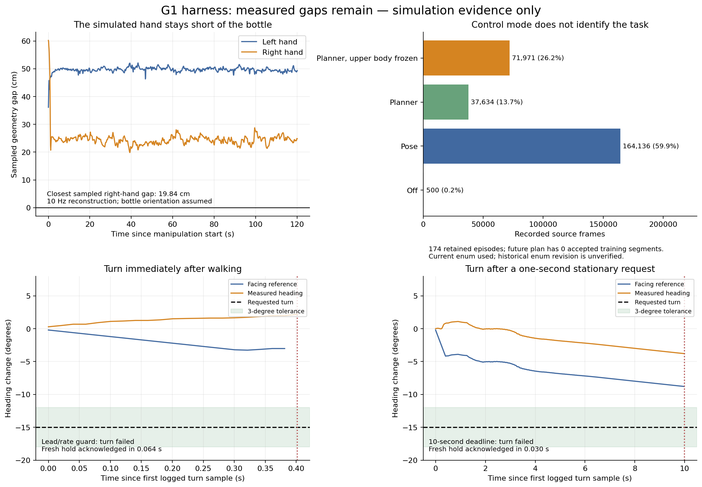
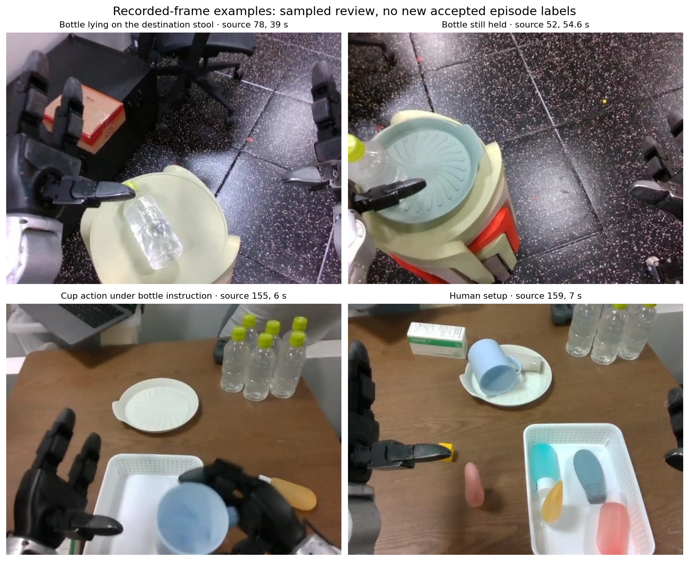
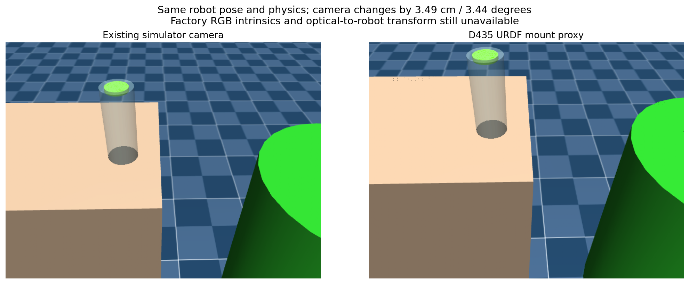

# G1 harness acceptance investigation — 2026-10-06

The harness can coordinate manipulation, bounded locomotion and standing reset.
Successful bottle placement and repeatable turns are still unvalidated. This
follow-up narrows the remaining problems without changing the controller,
checkpoint, prompt pool or training data. The dashboard remains in another session.

In plain language: the robot's practice examples need task review, the simulated
hand stops short of the bottle, and the camera view still needs calibration.
Waiting a second after walking did not solve the turn failure. Both new turn
failures received a fresh hold acknowledgement.

The figures are also available as [PDF](figures/acceptance-overview.pdf).
The bottle-distance panel reconstructs an earlier real-checkpoint simulator run;
the two turn panels show new simulator runs with scripted policy prewarm.

## Recorded demonstrations and future training

[Dense sampled review](dense-review/review.json) covers 316 frames on 23 contact
sheets from six source episodes. All sheets were visually inspected. These are
sampled observations, not continuous playback, exact accepted task boundaries or
new accepted episode outcomes. Source numbers below refer to the original data.

| Source episode | Observation | Consequence |
| --- | --- | --- |
| 5 | Existing user failure reference: bottle is grasped, then released toward the source tabletop around 18.5 s. | Reserve whole episode for future evaluation. |
| 18 | Existing user success reference: release is bracketed by 35.4–36.0 s samples; bottle remains on the stool through 40.46 s. | Reserve whole episode for future evaluation; initial floor views need separate task review. |
| 52 | Bottle is still held through 54.6 s; later samples tilt partly out of view with closed fingers. | Earlier sparse screening did not establish a drop. No new failure label. |
| 78 | Fingers open around 37.2 s; bottle lies on the stool from 37.4 s through sampled 44 s. | Provisional release candidate; lying support satisfies the current monitor criterion. |
| 155 | Cup and box actions, bottle-directed manipulation around 26–38 s, other objects and human resets share one recording. | Quarantine pending segmentation. Do not discard its bottle portion based only on the other tasks. |
| 159 | Sampled human setup and pink-object handling, with background bottles. | Quarantine pending complete review. |

Preparation previously assigned every retained episode the exact instruction
`pick drink bottle and place it on the right table`. The mixed-task frames show
why that instruction needs review at segment level. Existing source/prepared
episode mapping and files remain unchanged; source 155 maps to prepared 150,
and source 159 maps to prepared 154.

[Control-mode audit](control-mode-audit/audit.json) reads all 274,241 retained
frames across 174 episodes: 500 OFF, 164,136 POSE, 37,634 PLANNER and 71,971
PLANNER_FROZEN_UPPER_BODY. There are 26,444 mixed-mode full 40-frame windows.
Modes use the archived current exporter enum; its historical revision is
unverified. POSE does not prove a bottle task, and planner/frozen frames are not
automatically bad demonstrations. These window counts describe source frames,
not the precise training sampler or tail padding.

[The future dataset plan](dataset-plan.json) contains all 174 source checksums:
zero training episodes, two reserved evaluation references, two quarantined
episodes and 170 awaiting review. It is hand-authored review metadata joined to
the full audit. The 172 previously unaccepted episode outcomes remain unaccepted.
The reserved references were already seen by the current checkpoint; this split
can be held out only from a **future** training run.

[The standalone review checker](dataset_review_gate.py) requires accepted
task/success evidence and nonoverlapping frame segments. Every full 40-frame
action window must stay within one segment, and one source episode cannot cross
splits. Ten tests cover valid windows, leakage, provisional/wrong-task labels,
invalid bounds, quarantine, missing evidence and malformed metadata, including
list/object split values. It checks
metadata eligibility only; it does not verify label truth, export data or change
the training pipeline. [The current plan remains blocked](dataset-readiness.json)
with zero accepted training windows. No training or data export was performed.

## Completion monitoring

Eight new Genon `openai/gpt-5.6-sol` calls inspect saved frames: two held-bottle,
two released-bottle, two wrong-object and two setup frames. All eight frame
claims matched Codex's sampled visual labels. Six negatives produced zero false
completions; one two-frame sequence confirmed release. Decisions took
2.44–4.66 seconds. Labels are provisional frame review, not new human episode
labels or a held-out estimate of model reliability.

The initial evaluator exited 1 because the manifest incorrectly expected public
outcome `candidate` for the first positive frame. The monitor correctly returned
`in_progress` with streak 1, then `complete` with streak 2. The
[as-run manifest](vision_cases_as_run.json), [original responses/result](vision-recorded/result.json)
and [raw log](vision-recorded/evaluation.log) are preserved. The
[corrected manifest](vision_cases.json) and [rescored summary](vision-recorded/validated-summary.json)
agree with the saved responses; no additional API calls or production fix were
needed. The legacy evaluator field `user_outcome` explicitly identifies the
non-user review description. Fully hidden carried-bottle footage remains open.

## Manipulation distance and camera

[Offline distance reconstruction](bottle-reach-final/result.json) uses 1,182
saved 10 Hz poses from the earlier clear-cylinder/capture-cadence run. The closest
sampled hand collision geometry is 19.84 cm from the bottle on the right, and
36.13 cm on the left. Maximum robot/object timestamp skew is 0.98 ms. Bottle
orientation was not logged and is assumed upright. Samples can miss intermediate
minima; these distances are diagnostic, not contact acceptance evidence. The
earlier run independently logged no robot/bottle contacts and no grasp.
This result does not identify whether scene layout, perception, labels or policy
behavior caused the reach shortfall.

The user identified a RealSense D435i on the official G1 head mount. The native
URDF's fixed `d435_joint` places its link relative to `torso_link` at
`[0.0576235, 0.01753, 0.41987]` m, with RPY `[0, 0.8307767239493009, 0]` rad.
The existing simulator camera differs by 3.49 cm and, under an explicitly assumed
link-to-optical convention, 3.44 degrees.

[The frozen-pose camera comparison](camera-proxy/result.json) changes only camera
placement. Robot state inputs, geometry and physical parameters are identical;
physics is not advanced. The original 45-degree simulator vertical field of view
is retained. The URDF link is not established as the RGB optical origin, and
neither RGB intrinsics nor optical-to-robot mounting calibration was measured.
No checkpoint query was run on these comparison images.

[The read-only calibration helper](read_camera_intrinsics.py) enumerates D435i RGB
stream profiles and reads factory intrinsics using the
[official RealSense SDK profile API](https://github.com/realsenseai/librealsense/wiki/API-How-To).
It never starts a pipeline or sends robot commands. Its
[local check](camera-host-readiness.json) exits 2 as expected because
`pyrealsense2` is absent in the checked native Python environment. Run it on the
camera host with the actual resolution/frame rate; defaults 640×480/15 FPS match
the current driver's defaults, not verified historical recording settings.
Factory intrinsics still leave the RGB optical-to-robot transform to establish.

## New actual-native-loop turn checks

Both runs use the real native VLA loop as sole action publisher, real C++ SONIC
v1.1/V2 and headless MuJoCo on DDS `lo`. Camera frames and policy prewarm are
scripted. No manipulation skill runs, no latent action is published and no
physical robot is connected. Both pass measured standing reset and a one-second
backward command followed by a stop acknowledgement.

| Sequence before −15° turn | Turn outcome | Measured error at interruption | Fresh hold acknowledgement | Stationary packets in following second |
| --- | --- | --- | --- | --- |
| Immediate turn after walking | Lead/rate guard at 0.462 s | 17.19° | 0.064 s | 50 |
| One-second stationary request before turn | Deadline at 10.012 s | 11.21° | 0.030 s | 49 |

The pause itself lasted 1.034 seconds with 50 stationary planner packets. A
stationary command does not prove the feet and body are motionless. The guard
case needed reference retraction at 10.412°/s to restore its 5° lead limit,
exceeding the unchanged 10°/s rate limit. Its interrupted log retains an old
scalar reference; that value is not the measured-heading hold published next.
Active reference updates respect both limits.

Both interruptions advance telemetry, confirm hold, retain stationary world
facing and send no translation or resumed skill over the next second. Zero
`pose:v4` latent packets are observed. The new guard case closes **one** missing
actual-native-loop lead/rate interruption-and-hold check. Turning is still
unaccepted; one run per configuration does not isolate a cause or demonstrate
repeatability. All owned processes exited: native 0, SONIC and MuJoCo −15 from
the probe's cleanup. [Saved traces and summary](turn-repeat-summary.json) preserve
the exact sources and raw outcomes; `passed_control_checks` includes the verified
interruption path and does not mean the turn succeeded.

[Offline diagnosis of the earlier four turns](turn-diagnosis/diagnosis.md)
reconstructs the reference updates at numerical precision. The failed cases
consume most of the lead allowance. Positive-wrap entered tolerance only for
two roughly 40 ms intervals, short of the required 0.5 s. The reported
`base_quat_target` is an active, heading-corrected motion-frame target, not a
direct decoder motor output. Missing controller context, future trajectories
and frame scheduling prevent assigning the lag to a specific internal stage.
One instrumented loopback turn is the next discriminating check; it is proposed
in the diagnosis and has not been run. Limits remain unchanged.

## Verification and next work

[Current focused checks](review-fix-checks.log): 29 pass with no skips, comprising
ten dataset-review tests, seven completion-monitor tests and twelve existing
wire/probe helper tests. The [original 27-check log](software-checks.log) remains
preserved. Ruff passes; [the review correction](review-corrections.md) also records
a fresh full-suite run: 595 passed, 15 skipped and 46 warnings. Its initial sandbox
run aborted in a ZeroMQ bind fixture; the unrestricted rerun passed.

[The initial independent review](final-review.md) found no significant issues
and repeated the then-current 27 focused checks. It also checked the dataset
join, turn summaries, saved vision rescoring and reproduction CLI options.
Later review identified a missing commit sign-off and crashes on list/object
split metadata. [Both corrections](review-corrections.md) are applied; the original
reviewed checker, tests and manifest are retained under `review-before/`.

The remaining work is to review full task segments and outcomes, capture actual
RGB intrinsics and establish the optical mounting transform, match the sample
scene, then rerun manipulation. Instrument SONIC input/trajectory/frame timing
before changing turn behavior. Add fully hidden held-bottle clips to monitor
validation. Successful grasp/placement, repeatable turns, floor-home navigation
and supervised hardware acceptance remain open. Standing reset is a body-pose
reset; returning to the original floor location still requires localization.

[Provenance](provenance.json) records commands, source identities and expected
blocked/error outcomes. [The manifest](artifact-files.sha256.json) hashes this
archive, excluding itself and caches. Earlier evidence archives remain unchanged.
Task 8 remains open; this report does not authorize physical actuation.
