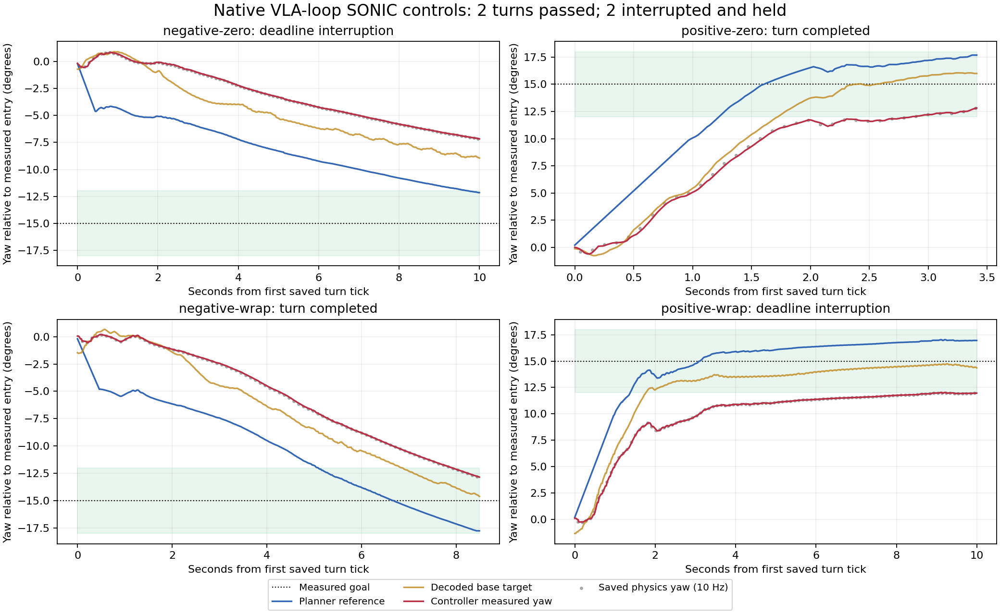
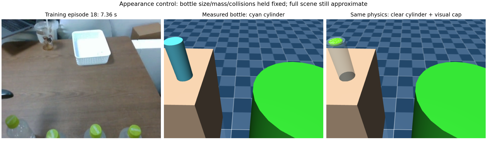

# G1 native-loop and training follow-up, October 6, 2026

The native VLA loop now requests replacement actions earlier. A deterministic
test reproduced an avoidable action-chunk gap before the fix. With the fix, a
real-checkpoint bottle trial continued for its full 120-second allowance and
confirmed hold on interruption. The bottle stayed on the source table throughout.

The training review found a separate problem: some retained recordings show
other manipulation tasks or scene setup, while preparation assigned them the
bottle instruction. The supervisor can enforce its prompt list, but that list
does not make the training examples describe the same job.

Four locomotion trials through the actual native loop passed standing reset,
a one-second backward command and the checked stop paths. Two turns completed;
two hit the deadline and received fresh hold acknowledgements. Task 8 and
hardware acceptance remain open. The dashboard stays in the other session.

[Turn plot](native-turns.png), [appearance comparison](appearance-comparison.png),
[training review sheets and notes](training-review/review.json),
[machine-readable results](validation-summary.json), and
[commands and source identities](provenance.json) accompany this report.
The plots also have PDF versions. All controller trials used DDS `lo`.

The previous adapter trials and their failed turns remain unchanged in the
[earlier archive](../g1_harness_20261006/README.md). These new trials run
`run_vla_inference.main` with its real harness lifecycle, reference conversion
and sole command publisher, real C++ SONIC v1.1 and MuJoCo. Only camera frames
and policy prewarm are scripted. Scripted actions are forbidden from publication;
the traces record zero latent packets. This tests locomotion plumbing, not VLA
manipulation or physical G1 operation.

| Setup heading / requested turn | Turn result | Final measured error | Elapsed |
| --- | --- | ---: | ---: |
| 0° / -15° | Deadline interruption | 7.829° | 10.077 s |
| 0° / +15° | Completed | 2.185° | 3.413 s |
| -170° / -15° | Completed across wrap | 2.155° | 8.489 s |
| +170° / +15° | Deadline interruption | 3.034° | 10.053 s |

The setup heading is an initialization request; each turn starts from the
measured heading after reset and walking. Successful turns have final measured
in-tolerance spans of 0.542 and 0.562 seconds, with 23 and 29 advancing telemetry
indices. Limits remain 10°/s, 5° reference lead, 3° measured error for 0.5 seconds,
and a 10-second deadline. The saved reference samples respect rate and lead.

For the deadline failures, advancing telemetry confirmed hold after 0.091 and
0.070 seconds. During the next second, the observer received 49 and 50 planner
packets requesting zero translation. World-facing targets remained fixed, the
interrupted phase remained latched, and the invalidated execution epoch did
not resume. Both successful-turn cases also passed loss-of-coordinator hold
with 49 stationary packets each. A hold acknowledgement and stationary requests
do not mean every physical joint instantly becomes motionless.

The plot separates the planner reference, decoded base target and measured
heading. The negative-zero case never reached its nominal reference because
the measured robot continued to lag at the lead limit. The positive-wrap case
reached its reference but stopped just outside the measured tolerance. Saved
10 Hz physics yaw follows the measured trend; it does not independently certify
sub-tick settling. These are tracking failures with checked deadline-stop behavior.
The older lead/rate-guard interruptions still lack their own subsequent hold
observations; this batch did not reproduce that guard condition. Repeatable
turning remains unaccepted.

The batch helper now exits unsuccessfully if a driver fails, omits its result
or fails control checks. Review caught its previous unconditional success exit.
A failed turn with `passed_control_checks` remains valid failure-stop evidence;
`turn_success` is recorded separately. The original batch output and a reconstructed
copy of its executed helper are retained. Current helper tests cover both outcomes.

The appearance control changes the cylinder's color/transparency and adds a
visual green cap. Both scenes retain the measured 20 cm height, 8 cm diameter
and 300 g mass. Compiled body inertia, collision geometry, actuator mappings and
camera parameters are identical; a one-second frozen-robot physics comparison
has zero qpos difference. The cap contributes no mass or contact. The bottle's
real shape, liquid distribution and optics remain approximate.

The two simulation views use exactly the same reconstructed pose and joint state,
from the saved sample about 17.7 ms before the prior skill start. The recorded
episode view is a visual reference from a different scene and time. The saved
appearance-control policy inputs therefore isolate rendered appearance at one
approximate simulation state; they were not used to claim policy success.

| Clear-cylinder trial | Native query scheduling | Skill elapsed | Object samples | Result |
| --- | --- | ---: | ---: | --- |
| Before scheduling fix | Interval after result acceptance | 28.322 s | 586 | Action chunk exhausted; hold confirmed |
| After scheduling fix | Interval from observation capture | 120.163 s | 1,499 | Manipulation deadline; hold confirmed |

In both trials, every saved bottle contact is with the source table; no robot
contact or destination support was recorded. All owned processes stopped.
The monitor uses scripted simulator truth with a one-second delay, so these
trials do not add Genon accuracy evidence. A cyan-bottle trial at the new cadence
has not been run. The previous cyan trial used the old cadence, so the two
120-second trials cannot establish an appearance-only effect on policy behavior.
Neither has established a grasp or released placement.

The timing defect used two different clocks. A chunk lasts 40 frames at 50 Hz,
or 0.8 seconds from observation capture. The loop previously waited another
0.4 seconds after accepting the result before requesting its replacement.
Two 0.25-second calls can therefore leave a gap even though each result is fresh.
Harness mode now schedules from capture time. Existing expiry, epoch, pause
and freshness checks remain active; legacy non-harness cadence is unchanged.
Inference that outlasts the remaining horizon still interrupts. The archived
red test fails with `action_chunk_exhausted`; the fixed test passes, while a
0.9-second result is still rejected without latent publication. The live rerun
supports the fix but does not isolate the exact timing of the original incident.

The source metadata names SONIC v1.1 encoder/decoder and the V2 target-velocity
planner, matching the deployed model family and paths. It does not contain
historical weight hashes, so exact historical decoder identity remains unverified.
Source parquets have root orientation and joint state but no absolute root
translation. They cannot by themselves recover the camera-to-table arrangement.
Full scene calibration remains false.

All 31 timestamped sheets were visually screened: 12 previously unreviewed
episodes plus the two user-confirmed references. The review samples each timeline,
its final three seconds and flagged intervals. A long interval is sampled at
gaps no greater than 15 seconds. Brief events can fall between samples. This is
provisional screening; it adds no accepted outcome labels.

| Source episode | Observed review candidate | Next check |
| --- | --- | --- |
| 14 | Mostly fixed floor/table view during the 26.94-455.94 s flag | Check transitions before trimming |
| 42, 45, 55, 146, 151 | Setup, floor/person views or post-task footage | Establish task boundaries and outcome |
| 52 | Held bottle near stool, then tilted/missing in final samples | Review 49-55 s for release or drop |
| 78 | Released-looking bottle on stool, followed by basket/setup changes | Review 35-44 s densely and confirm desired pose |
| 140 | White cylindrical object and a different tabletop arrangement | Verify task/object identity |
| 150 | Carried bottle, basket view, then floor pause | Verify destination and task boundaries |
| 155 | Sampled robot actions manipulate cup, box and colored objects | Audit task labels before any new training |
| 159 | Person arranges objects while robot hands appear largely unchanged | Review the full 8 s for setup boundaries |

[Episode 155 sheet](training-review/episode_000155_overview_0.jpg) and
[episode 159 sheet](training-review/episode_000159_overview_0.jpg) show the label
concern. Source metadata uses `place OBJECT on the table`; preparation assigns
every retained episode `pick drink bottle and place it on the right table`.
Source 155 maps to prepared 150, and source 159 to prepared 154. The archived
prepared metadata confirms that bottle instruction for both. This identifies
incompatible sampled training content, but does not prove it caused the live
failure or establish that an entire episode contains no bottle action.

Episode 18 remains the user-confirmed success reference and episode 5 the failure
reference. Of 174 retained episodes, 172 still lack complete outcome review;
12 of those now have sampled screening notes and 160 have no such screening.
The original recordings, labels, checkpoint and prompt pool were not changed,
and no training was started.

| Fresh software check | Result |
| --- | --- |
| Native component suite | 629 passed |
| VoLoAgent normal suite | 595 passed, 15 skipped |
| Explicit required G1 cross-process command | 9 passed, zero skips |
| Planner-wire and batch-helper checks | 12 passed |
| Ruff on changed native files and current follow-up scripts | Passed |

The native sandbox attempt passed 628 tests and failed the local-IPC binding
test with `Operation not permitted`; the unrestricted rerun passed all 629.
VoLoAgent's normal skips include nine integrations without explicit native paths
and six existing skips. This turn's explicit cross-process command collects
nine tests; its log is separate from the previous archive's 50-test log.
[Review findings](review.md) and raw software logs are retained.

The next acceptance work is to audit task boundaries and language labels,
prepare a reviewed derived dataset with a held-out split, and match camera and
starting scene before judging the checkpoint. Further turn work needs repeated
measured tracking at the unchanged limits, including the older lead/rate-guard
failure path. Fully hidden carried-bottle monitoring and successful live release
remain pending. Supervised hardware requires deployment-readiness confirmation.
Returning to an earlier floor location still needs localization/navigation;
new manipulation subgoals still need demonstrated and evaluated prompt support.

[The archive manifest](artifact-files.sha256.json) hashes this follow-up only.
The October 1, October 2 and earlier October 6 archives are preserved.
