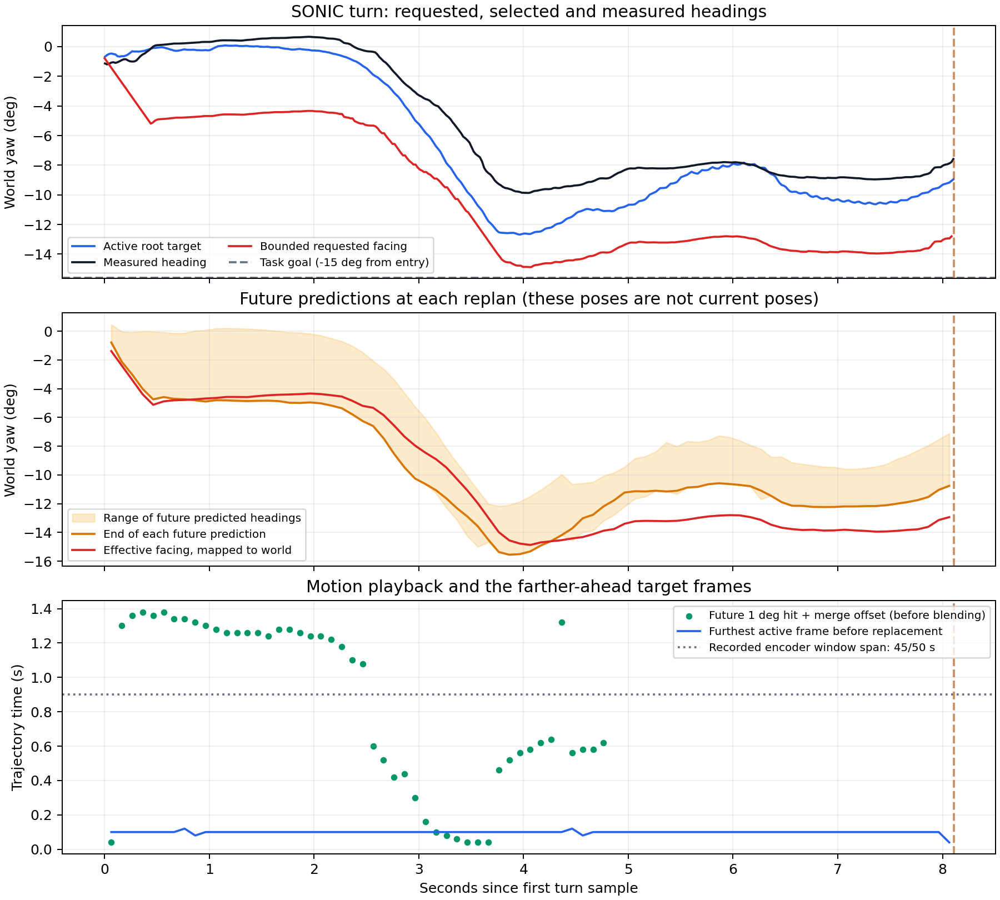

# Instrumented SONIC turn and D435i calibration read

The requested direction reaches SONIC correctly, but the simulated robot still
does not finish the turn. The new trace shows where the requested direction,
predicted motion, active target and measured heading diverge. Factory camera
intrinsics are now available from `pc2_222`; the camera-to-robot pose remains
unmeasured. Task 8 stays open.

Think of this as watching four steps: “turn here,” the planner's drawing of a
future motion, the part of that drawing currently selected, and where the robot
actually points. The instruction survives the handoff. Some future drawings get
close to it, while the selected and measured headings remain behind. We need a
controlled comparison of trajectory generation, blending/playback and tracking
before choosing a control change.



## What ran

One instrumented negative-zero repeat uses the existing native-loop probe,
one-second backward command, models, scene and limits. Initial yaw is zero;
the requested turn is −15° with no extra pause after walking. DDS uses `lo`.
The native VLA loop is the sole action publisher, with scripted camera/prewarm
responses. It queries no VLA checkpoint and publishes no latent action.

The controller adds an opt-in `--planner-trace-file` flag. It requires loopback,
disabled simulation CRC checks, `zmq_manager` and a planner file before controller
initialization. Fixed buffers are allocated before its threads start. The live
callbacks copy fixed records; serialization happens in main after the trial's
existing keyboard stop. A successful close/rename publishes the completed file,
and the probe validates record counts after process cleanup.

Capture includes the facing tensor and four-frame context, raw/resampled future
quaternions, generation identities, blended trajectory, selected frame, heading
correction, measured quaternion, motor targets/measurements and host timestamps.
Initial phase durations are unavailable and serialize as null. The movement
buffer timestamp identifies a local update; the wire has no sender sequence.
State-publication timing is separate from the 500 Hz DDS motor writer.

The [as-run sources](native-negative-zero-run/as-run/) preserve the precise trial
implementation. A later validator hardening makes list/object event values return
`ValueError`; the actual trace validates identically. The first sandbox attempt
failed at ZMQ socket creation before launching any simulator/controller process;
its partial setup is retained in `native-negative-zero/`.

## Result

The [run result](native-negative-zero-run/result.json) separates control checks
from task success: `passed_control_checks`, **`turn_success: false`**.

| Check | Observed result |
| --- | --- |
| Standing reset | Passed measured dwell |
| One-second backward command | Passed duration and stop acknowledgement |
| −15° turn | Interrupted after 8.167 s by the lead/rate guard |
| Fresh stationary-hold acknowledgement | 0.129 s after interruption |
| Following second | 50 stationary packets; no translation/resumption |
| Latent actions on wire | Zero |
| Controller/native/simulator exits | 0 / 0 / −15, all owned processes stopped |
| Memory trace | 87 plans, 87 merges, 799 control samples; no overflow/truncation |

The guard saw an old scalar reference 5.217° ahead of measured heading. Returning
inside the 5° bound would have needed 10.814°/s, above the unchanged 10°/s limit.
That interrupted row's scalar reference is not the new measured-heading hold
published afterward. The 3°/0.5-second success criterion and 10-second deadline
are also unchanged.

## What the trace resolves

[Offline findings](findings.json), [per-plan rows](plans.csv) and
[per-control rows](controls.csv) come from [analyze_trace.py](analyze_trace.py).

- All 81 turn replans have identical wire/received/effective facing components.
  Mapping them back to world agrees with a nearby native turn reference within
  0.000001°. This gives no evidence of a direction-sign or reference-frame error.
- Selected quaternions match their recorded blended trajectory exactly; target
  quaternions match the native telemetry exactly. Generation-frame mismatches
  are zero. The observed telemetry index is one below the control trace tick.
- Planning takes 6.19–10.26 ms; inference takes 6.16–10.23 ms. Merge follows the
  recorded plan end by 0.53–12.55 ms. This run gives no evidence of a large
  inference backlog at the 100 ms replanning interval.
- 49 of 81 raw predictions come within 1° of that call's **bounded facing**, with
  a median first hit 1.03 seconds into the prediction. The resampled count is 48.
  These comparisons concern the call's facing, not the final −15° task goal.
- The controller selects frames 1–6 before replacement: at most 0.12 seconds of
  each newly blended timeline. In 41 of the 48 resampled predictions that reach
  facing, the first close frame lies later than that active-frame range. The
  encoder also reads a lookahead window spanning 46 frames/45 intervals (0.9 s);
  early active-frame replacement does **not** mean the policy only sees those
  early frames. Recorded horizons are 44 raw, 73 resampled and 75 merged frames.
  Generated and merged timelines differ by two frames (0.04 s). The plot aligns
  the generated hit times by that offset before comparison, giving the same
  41/48 count. Those hit indices precede blending; blending can shift actual hits.
- The active root target gets within 2.896° of the task goal, but measured heading
  gets no closer than 5.706°. Target-to-measured gap has a 1.275° median and 3.501°
  maximum over the turn. Measured heading never enters the 3° success band.

This localizes useful questions to generation/context, activation/blending and
lower tracking. It does not prove that changing replan frequency or blend width
fixes the failure. Some generated futures also stop short; motor values alone do
not isolate decoder behavior from contacts/physics. The trace itself adds memory
copying/atomic bookkeeping, so one observed timing comparison is not a causal
or repeatability result. No command behavior or acceptance limit was changed.

## Camera read on pc2_222

The user supplied the SSH alias. It resolves to `unitree-g1-nx`. The
[read-only helper as run](camera-helper-as-run.py) enumerates SDK profiles and
reads factory intrinsics without `pipeline.start`, images or robot commands.

[Factory intrinsics](d435i-intrinsics-640x480-15fps.json) for advertised RGB8
640×480 at 15 FPS:

| Value | Factory result |
| --- | --- |
| Camera | Intel RealSense D435I; firmware 5.15.1.55 |
| fx / fy | 604.1786 / 603.9078 pixels |
| cx / cy | 316.7535 / 255.6288 pixels |
| Distortion coefficients | Five zeros; SDK model inverse Brown–Conrady |
| Horizontal / vertical angular span | 55.8143° / 43.3242° |
| Existing simulator vertical FOV | 45° |

The [comparison](camera-comparison.json) uses the factory principal point when
calculating edge-ray angular spans. Its image center is offset by −3.25 pixels
horizontally and +15.63 vertically. The actual active recording/runtime profile
and RGB optical-to-robot transform remain unconfirmed. Physics, camera rendering
and policy inputs were not changed in this step. A factory intrinsic query does
not measure the mounted camera pose.

A read-only [process-name scan](camera-service-paths.json) found no matching
camera/image-server script in its limited search of process arguments. Its
[exact scan](camera-service-scan-as-run.py) is retained. This does not establish
whether another service is using the camera, and supplies no active profile.

## Verification and next work

Fresh focused Python checks: **39 passed** (the previous 29 plus 10 trace-integrity
cases). Native checks: **6 trace tests and 11 hold/telemetry/safety tests passed**.
The controller builds. The first broad C++ run passed 16 tests and failed its
existing FK test because the legacy motion/XML fixtures were absent from that
working directory; the final additional timing regression is included in the
six trace tests. Sandbox ZMQ restrictions and initial failures remain in logs.
This report does not claim a clean unrestricted full repository suite.

The [deployment preflight](deploy-preflight-unrestricted.log) passes CUDA/PyTorch,
Python, TensorRT and disk checks outside the sandbox. It exits 1 because an
unrelated decoupled-WBC balance-model file is still a Git LFS pointer in the
isolated native checkout. The actual SONIC models used above are present and
hashed. No dependency or model download was performed for this diagnostic.

Review found and resolved three reporting defects: a window length mislabelled
as a frame index, unavailable initial timings presented numerically, and accepting
an incompletely flushed file. [Review notes](review.md) record the follow-up.
All 203/423/316/138 hashed files in the four previous manifested archives remain
unchanged. Models and registry are unchanged; [provenance](provenance.json) records
their hashes and the new controller hash.

1. Compare captured contexts and facing inputs in an offline native-model replay,
   separating generated future response from blending/frame replacement. Use
   the same model/seed and preserve the existing turn/stop limits for any later
   simulator comparison. This trace is the input fixture for that work.
2. Confirm the camera service's actual RGB profile and measure RGB optical pose;
   then apply the measured intrinsics/pose to the frozen-pose camera comparison.
3. Finish accepted segment/outcome review before creating a new training subset.
   Accepted training windows remain zero; source 155/159 remain quarantined.
4. Rerun manipulation only after the scene/view and reach mismatch are resolved.
   Supervised physical trials still need operator readiness; dashboard work stays
   assigned to another session.

Reproduce analysis without launching simulation:

```bash
/home/jihun/work/Isaac-GR00T/.venv/bin/python \
  docs/artifacts/g1_harness_20261006_instrumented/analyze_trace.py
```

The probe command is in the saved launch events and takes `--controller-trace`.
Running it launches a new loopback trial; it is not part of offline reproduction.
