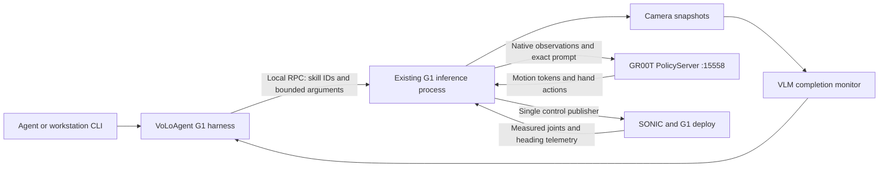

# Unitree G1 harness design

The first working mission is: pick up the bottle, place it on the right table, confirm placement from the camera, pause VLA inference, and return to SONIC's straight standing pose. The next milestone adds short walking and turning commands through the same executor.

VoLoAgent chooses from a menu of skills and watches the result. The existing G1 inference process carries out those requests and remains the only publisher of robot control messages. This keeps the model server, motion tokens, hand actions, and SONIC controller on their native path.

## Existing evidence and limits

| Item | Current evidence |
| --- | --- |
| VLA checkpoint | `/mnt/data/jihun/models/pnp_bottle_260916_n17_raw_gpu7/checkpoint-20000` |
| Fine-tuning prompt | `pick drink bottle and place it on the right table` |
| Policy server | Workstation port `15558`; use `127.0.0.1:15558` when the G1 client runs on this workstation |
| Embodiment | Serving config `UNITREE_G1_SONIC`; native inference CLI `unitree_g1_sonic` |
| Action representation | Motion tokens `[1,40,64]` and two hand arrays `[1,40,7]`; 50 Hz publication |
| Serving check | Recorded observations produced finite actions; documented warmup 6.27 s and next query 0.13 s |
| Standing reset | `StandingReset` follows measured joints, preserves heading at reset entry, and uses SONIC PLANNER mode |
| Locomotion | `ManualPlanner` already supports 0.2 m/s translation and heading changes from keyboard input |
| Missing integration | RPC control, ownership, mission completion, bounded locomotion, and measured reset completion |

The training and serving evidence is in [the experiment README](/home/jihun/work/GR00T-WholeBodyControl/docs/artifacts/pnp_bottle_260916_raw_training_20260930/README.md). The runtime source is [run_vla_inference.py](/home/jihun/work/GR00T-WholeBodyControl/gear_sonic/scripts/run_vla_inference.py), with [standing_reset.py](/home/jihun/work/GR00T-WholeBodyControl/gear_sonic/utils/inference/standing_reset.py) and [manual_planner.py](/home/jihun/work/GR00T-WholeBodyControl/gear_sonic/utils/inference/manual_planner.py).

A successful policy response means actions are available. It does not mean the bottle task finished. The current response has no validated task-completion signal. Serving checks also do not establish manipulation success on hardware.

Standing reset restores the preset upper-body and hand pose while keeping the heading measured when reset begins. It does not return the robot to its original floor position. `base_trans_measured` in the current C++ telemetry is a fixed default, so it cannot support a home-position controller.

The native runtime workspace currently contains unrelated edits, including its inference runner and launcher. Implementation must preserve those edits and work in isolated checkouts. The chosen base must include the reset and manual-planner behavior inspected here; a worktree made from an older commit will not automatically include dirty changes.

## Scope

Milestone 1 exposes observation, the bottle manipulation skill, pause, cancel, status, and standing reset. It includes an end-to-end mission runner and evidence logs. The VLA receives the exact fine-tuning prompt throughout this mission.

Milestone 2 exposes `walk_for` and `turn_by`, then accepts validated sequences such as bottle placement, standing reset, a short backward walk, and a turn. Walking ends at a deadline. Turning ends at a measured heading target. Both require fresh feedback and the same exclusive ownership as manipulation.

Later work covers localization and return to a saved floor pose, collision-aware navigation, additional manipulation skills and prompt training, and object-aware recovery. Generic grasp/place tools currently written for Franka/DROID cannot be advertised as G1 skills without a G1 implementation and validation.

## Runtime layout

Add a separate `volo-g1-harness` entry point in VoLoAgent. Reuse its VLM API helpers and `VLMFailureHandler` through a G1 completion adapter. The current proxy's canonical `[N,8]` action representation cannot carry native G1 motion tokens and hand arrays; the harness therefore talks to the G1 executor directly.

The native executor keeps its existing `PolicyClient`, observation construction, action packing, heading conversion, and control publisher. Its opt-in RPC worker parses requests and queues them. Only the existing 50 Hz loop changes control state or publishes commands. RPC serialization, camera decoding/JPEG encoding, model inference, and VLM calls run outside that loop. Each ZMQ socket belongs to one thread.

Use Python 3.10+, existing pyzmq, NumPy, PyYAML, OpenAI client and image dependencies. Keep the GR00T environment separate from VoLoAgent's environment. Neither repository imports the other's package. The repositories share a YAML profile and a versioned JSON wire contract, checked with identical golden fixtures.

## Profile and skill menu

Create `configs/g1/workstation.yaml` with schema version 1, the checkpoint and endpoint above, camera key `ego_view`, horizon 40, publication rate 50, the limits below, and the skill `bottle_to_right_table`. Its prompt is exactly the string above; its completion criterion is a bottle visibly placed on the right table and released by the robot.

Both processes load the same file. `registry_sha256` is the SHA-256 of its raw bytes. A claim with a different digest fails before control is granted. Report checkpoint identity as configured/expected unless the serving process supplies verifiable identity; a listening port and correct output shape alone do not prove the loaded checkpoint.

The agent-facing menu contains `observe`, `bottle_to_right_table`, `reset_standing`, `pause_manipulation`, and `cancel`; add `walk_for` and `turn_by` after milestone 2 passes. Agents submit skill IDs with typed arguments. The executor independently looks up manipulation prompts and rejects unknown IDs, extra arguments, arbitrary prompt strings, unsupported skills, non-finite values, and out-of-range motion requests. Expansion of the menu requires a new validated skill entry; connecting the present bottle skill does not require new VLA training.

## RPC contract

Default endpoint: `ipc:///tmp/volo-g1-harness.sock`, configurable to another local IPC path. Version 1 has no remote TCP control endpoint. Refuse a second live server on the same path; do not unlink a live peer's socket. Use local-user permissions on the IPC socket.

Every request has `version`, `request_id`, `runtime_id`, `session_id`, `lease_id`, `method`, and `params`. Only the initial `get_status` may omit `runtime_id`. Read-only calls have null lease fields. Responses echo `request_id` and current `runtime_id` and contain either `result` or `error` with `code` and `message`.

| Method | Exact params | Result |
| --- | --- | --- |
| `get_status` | `{}` | Status |
| `observe` | `{}` | ObservationSnapshot |
| `claim_control` | `{"registry_sha256": str}` | Lease |
| `heartbeat` | `{}` | Status |
| `start_manipulation` | `{"skill_id": str}` | Execution |
| `pause_manipulation` | `{"execution_id": str}` | Execution |
| `reset_standing` | `{"execution_id": str, "open_hands": bool}` | Execution |
| `cancel` | `{"execution_id": str}` | Execution |
| `release_control` | `{}` | Status |
| `walk_for`, milestone 2 | `{"direction": "forward"|"backward"|"left"|"right", "duration_s": float, "speed_mps": float}` | Execution |
| `turn_by`, milestone 2 | `{"angle_rad": float, "rate_rps": float}` | Execution |

Motion calls return acceptance and an execution ID promptly; the client polls status for completion. No RPC waits for a robot motion to finish. Standing reset continues the paused manipulation execution. A standalone reset is accepted with an empty execution ID only from idle with fresh feedback, and allocates a new execution ID. Walking and turning each allocate an execution ID.

Use these exact result fields; optional values are JSON null:

| Result | Fields |
| --- | --- |
| Status | `runtime_id: str`, `phase: str`, `skill_id: str|null`, `execution_id: str|null`, `inference_epoch: int`, `controller_running: bool`, `policy_ready: bool`, `mode_requested: str|null`, `planner_reference_active: bool|null`, `hold_confirmed: bool`, `telemetry_age_s: float|null`, `telemetry_index: int|null`, `observation_age_s: float|null`, `frame_id: str|null`, `registry_sha256: str`, `policy_host: str`, `policy_port: int`, `checkpoint_expected: str`, `owner_session_id: str|null`, `reason: str|null` |
| ObservationSnapshot | `runtime_id: str`, `execution_id: str|null`, `inference_epoch: int`, `camera_key: str`, `source_timestamp: float`, `frame_id: str`, `received_at: float`, `age_s: float`, `jpeg_rgb_b64: str` |
| Lease | `runtime_id: str`, `session_id: str`, `lease_id: str`, `expires_at: float` |
| Execution | `runtime_id: str`, `execution_id: str`, `skill_id: str`, `phase: str`, `inference_epoch: int`, `started_at: float`, `reason: str|null` |

`controller_running` reports the native runner's operator-controlled flag, not an independent motor acknowledgement. A sent control message records `mode_requested`; fresh `planner_reference_active=1` confirms planner activation. Flag 0 means non-planner, and must not be labeled a confirmed POSE mode or proof of motor shutdown. Time fields ending in `at` use the workstation's monotonic clock. Profile identity is reported as expected.

Snapshots decode to RGB images. Advance frame ID only when the source camera timestamp changes. A repeated source timestamp must age normally, even if the camera server republishes it. Track feedback freshness using advancing telemetry `index`, with receipt time for age; `ros_timestamp` may be zero. Bind snapshot execution/epoch fields in the main loop when answering observe, and reject monitor frames received before the execution's `started_at`.

Cache responses for repeated `(session_id, request_id)` within a runtime instance. Identical retries return the original reply without restarting motion or renewing ownership. Conflicting reuse fails. A runtime reboot changes `runtime_id` and rejects requests targeting the old instance. RPC timeout recreates a REQ socket before retrying the same request ID. Error codes are `INVALID_REQUEST`, `PROFILE_MISMATCH`, `BUSY`, `NOT_READY`, `NOT_OWNER`, `EXPIRED_LEASE`, `STALE_RUNTIME`, `REQUEST_CONFLICT`, `UNAVAILABLE`, `UNSUPPORTED_SKILL`, and `FAULT`.

## Control ownership and failure behavior

Claim is allowed only when the operator has already started the existing control loop and paused policy execution. Claim does not start motors or the deploy process. One lease owns the executor. An agent mission has one heartbeat worker with its own RPC client/socket; VLM latency must not delay heartbeats.

Keyboard mode, motion, prompt, hand-preset, pause/resume, or control-loop changes revoke agent ownership and interrupt the mission. Recording keys keep their existing behavior; a key revokes ownership only when it actually changes control state. For example, `s` used by the exporter to stop recording does not count as a locomotion override outside manual mode. No automatic re-claim or resume follows operator intervention. Route agent and keyboard control changes through the same pause/invalidate/reset hooks while preserving existing keyboard semantics.

On pause, cancellation, handoff, or prompt change: increment the inference epoch, clear cached actions, drain queued requests/results, and reject late worker results from earlier epochs. In harness mode, validate finite action arrays of the exact shapes above and the existing motion-token absolute bound of 1.25. Reject a chunk older than 40/50 = 0.8 s from its observation capture. Never publish the final frame repeatedly after the chunk expires. When chunks run out, attempt a measured planner hold and mark the execution interrupted; do not resume automatically on a late result.

Prewarm the native policy worker while policy publication is paused, using a valid recorded or live observation. Discard all prewarm outputs and set `policy_ready` only after successful shape/finite checks. This asynchronous preparation must not block the action loop or an RPC. Manipulation start requires `policy_ready`, an idle inference worker, fresh sensors, and active ownership; every active inference still uses the 0.8 s capture-age limit. Recheck camera and feedback freshness before each active inference; cached frames must not acquire a new capture time simply because the worker reads them again.

Successful manipulation follows this state sequence:

`IDLE -> MANIPULATING -> PAUSED -> RESETTING -> COMPLETED`

Accept standing reset only after pause acknowledged invalidation. Begin with a measured upper-body hold, preserve the measured heading, request PLANNER, wait for fresh planner-active telemetry, then advance the existing reset ramp. Successful placement may use open hand targets. Mark completion only after measured joints and heading satisfy the settling rule below.

Cancellation, uncertain placement, task timeout, inference failure, or lease expiry must not open the hands or run the full standing reset automatically. With valid fresh feedback, attempt a zero-locomotion planner hold preserving measured upper-body and hand positions, then report `INTERRUPTED` or `FAULT`. If feedback is unavailable or planner activation is unconfirmed, suppress new VLA output and report `FAULT` with `hold_confirmed=false`. This does not establish the robot's physical state. Verify the deploy controller's behavior on lost input in simulation before enabling agent control on hardware; physical emergency stop remains independent.

Release normally requires a paused or completed execution and a confirmed stationary planner hold. An interrupted client cannot extend motion beyond a lease/deadline. After a fault or operator override, a new mission needs explicit operator preparation and a new claim.

## Completion monitor

The G1 adapter owns scheduling and freshness checks, and feeds `ego_view` images plus the initial image and the skill's completion criterion to `VLMFailureHandler`. Set its recovery mode to `replan`, but intercept the returned actions: accept only `status="complete"` together with `action="next"` as a completion candidate. Never execute an invented replan instruction. Failure/replan requests interrupt and wait for operator inspection.

Require two consecutive complete candidates from distinct fresh source frames, bound to the current execution and inference epoch. Frames must have been received after execution start. An in-progress result, malformed response, missing/stale frame, API exception, or late decision clears the confirmation streak. Ignore `HandlerResult.confidence` as a probability because its default is 1.0. An API error returning no handler result must still count as an attempted check for timeout/logging.

This is a camera-based heuristic, so log the two evidence images, model responses, and latency. Validate it on recorded success, failure, occlusion, and bottle-still-held examples before hardware use. If the scene cannot show release and placement clearly, pause for operator inspection. Stronger perception or independent success signals can replace this monitor later.

## Proposed limits

These settings are implementation starting points. They have not been validated as hardware operating limits. Profile validation may tighten them, but must reject settings exceeding the hard maxima below.

| Setting | Value / hard maximum |
| --- | --- |
| Controller publication | 50 Hz |
| Fresh feedback / camera at capture | Age <= 0.5 s |
| Lease / heartbeat / RPC timeout | 2.0 s / 0.25 s / 0.5 s |
| Prewarm policy deadline | 10 s, non-actuating |
| Active policy reply deadline | 2 s; usable chunk age still <= 0.8 s |
| Planner activation deadline | 2 s; telemetry must advance after request |
| Standing ramp | Existing <= 0.5 rad/s, <= 0.15 rad command lead |
| Standing settling | Max error <= 0.05 rad over 17 upper-body and 14 hand joints; heading error <= 5 degrees; hold for 0.5 s of fresh advancing feedback |
| Standing reset deadline | 15 s |
| Manipulation deadline | 120 s |
| Monitor cadence / call deadline / decision expiry | 1 s / 10 s / 10 s from image capture |
| Walk | 0 < speed <= 0.2 m/s; 0 < duration <= 5 s; current heading at entry defines forward |
| Turn | 0 < abs(angle) <= 45 degrees; 0 < rate <= 10 degrees/s; shortest wrapped yaw error, <= 5 degree target lead |
| Turn settling / deadline | Error <= 3 degrees for 0.5 s of fresh feedback; 10 s deadline |

The loopback-tested implementation adds bounded tracking trim after a nominal
reset or turn reference is reached. Standing trim affects only the 17 upper-body
references, is capped at 0.15 rad, and uses half the configured joint tolerance
as its deadband. Turn trim is capped at the configured heading lead. Both retain
the command rate/lead limits and compare measured settling with the original
physical target; neither relaxes a tolerance, dwell, or deadline. Hardware
validation of this outer feedback correction is still required.
Turn feedback moving backward retracts the reference into the measured lead
interval. If a feedback jump makes rate and lead bounds incompatible, execution
interrupts and requests a measured hold. Current physical turn trials still
miss the tolerance; software regression checks alone do not accept this gate.

Walking completion means the duration expired, zero movement was commanded, and fresh planner-active telemetry followed. It does not prove a requested distance or zero measured base velocity; the current telemetry cannot prove either. Turning completion uses measured yaw. Stale feedback interrupts both skills and clears their movement request.

## Validation and acceptance

Milestone 1 must pass registry/contract tests, native runtime lifecycle tests, monitor tests, and a non-actuating end-to-end test with a fake policy and scripted monitor. The test must show exact prompt selection, one publisher, completion confirmation, epoch invalidation, fresh planner activation, measured settling, and terminal completion without task recycling.

Run separate checks for the actual checkpoint with recorded observations, SONIC control transitions in MuJoCo, and manipulation performance in a scene that really contains the bottle and right table. A generic standing simulation cannot establish bottle-placement performance. Report those results separately. No test in this planning task starts robot control.

Milestone 2 must demonstrate walk deadlines, measured turn targets across +/- pi, preserved hands, fresh heading-frame conversion, cancellation, and loss of the coordinator in simulation before hardware evaluation.

Hardware acceptance needs the explicit readiness confirmation required by the deployment workflow. It proceeds from observe-only and pause/reset to supervised bottle placement, then short locomotion. Report trial counts, placement outcome, monitor mistakes, reset error/settling time, and interventions. Abort or uncertain outcomes remain visible in the evidence log.

Log newline-delimited JSON per mission: monotonic times, runtime/session/execution/request IDs, profile digest, selected skill and exact prompt, transitions, applied planner evidence, policy/monitor latency, rejected stale actions, failures, and evidence-image paths. Do not log credentials. Persist a terminal result and require a new explicit mission to start again. CLI model configuration uses `--vlm-model`, `--vlm-base-url`, and `--vlm-api-key`, with credentials falling back to `VLM_API_KEY` then `OPENAI_API_KEY`; require an explicit model/endpoint for manipulation rather than accepting placeholder values.
