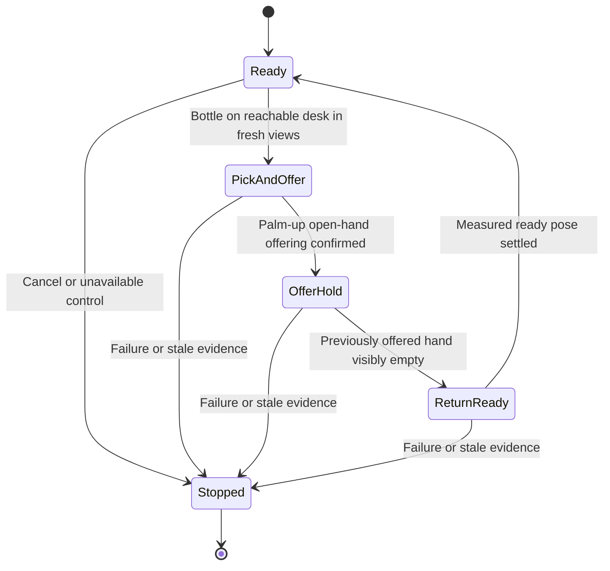

# G1 bottle handover autopilot

Status: user-approved design, 9 October 2026. Software implementation is in
progress; hardware acceptance has not started.

## Goal

The arrangement is person → desk → Unitree G1. The robot stands close enough
to reach a bottle on the desk. It repeatedly detects a drink bottle, picks it
up, turns its holding hand palm-up, opens the fingers so the person can take
the bottle, observes its empty hand, and returns that hand to a handshake-ready
pose. The robot remains standing in the same place throughout the loop.

This replaces bottle placement on the green stool as the active development
target. The earlier placement reports and corrections remain historical
evidence. Walking, turning, return-to-floor-home and the deferred dashboard
are outside this handover loop.

The working assumption is the right hand: sampled videos show the offering
motion and the recorded right-arm joint variation supports that interpretation.
The user confirmed episodes 15 and 30 as the intended reference examples,
including the ready phase. Episode 15's visible empty-hand terminal frames
provide a candidate ready-pose target. Extract that target from measured
joints and validate its controlled return; the
[candidate extract](../../artifacts/g1_handover_20261009/ready-pose-candidate.json)
records named joint values without deploying them. No guessed joint angles
will be used as a hardware ready pose.

## Dataset evidence

The provided path is
`/home/jihun/work/GR00T-WholeBodyControl/outputs/handover_bottle_260930`;
it resolves to `/mnt/data/jihun/datasets/G1_WBT_GR00T/handover_bottle_260930`.
The [audit](../../artifacts/g1_handover_20261009/README.md) covers 61 parquet
episodes and 61 ego videos, 30,035 rows at 50 Hz, or 600.7 seconds.
All video frame counts/rates match their parquet episodes. State and motion
tokens are finite, their checked dimensions match the native representation,
and the largest absolute motion token is 0.5625, below the current 1.25 limit.
These checks establish numeric/transport consistency, not successful handovers.

Every row uses task index 0, currently labeled `place OBJECT on the table`.
There are no per-phase language columns and no defined held-out split.
Do not train the new handover task from those labels without review and
derived-task annotation. No handover checkpoint was identified in the checked
workstation model directory or local experiment documentation. A checkpoint
may exist elsewhere; the active profile still names the old placement model.

Sampled episodes 0, 15 and 30 show bottle pickup and offering. In episode 15,
the bottle rests sideways on the open palm before the person removes it, and
frames 415–431 show an empty palm. The user confirmed episodes 15 and 30 in
response to the request for full-cycle references, including the desired
empty-hand ready pose. This establishes the reference choice; the sampled
views alone do not independently verify a continuous settled ready return.
Episode 30's final sampled frame is during removal. Sampled episode 45
contains desk/object setup; episode 60 contains a changing camera/workspace
view after its early manipulation. Episode 54 includes human repositioning
and needs separate outcome review. These are review flags, not accepted cuts
or final outcome labels.

Episode 16 is a user-confirmed failed offer: the hand angle makes the bottle
roll off the open palm, followed by human rescue around sampled frames
335–360. Stable, level support is required; opening the fingers is insufficient.
A later empty hand must not erase this failure. See the
[failure evidence](../../artifacts/g1_handover_20261009/episode-16-failure.json).

## Approaches

| Approach | Benefit | Limitation |
|---|---|---|
| One VLA pickup-and-offer skill, native hold/ready return, explicit perception loop | Reuses the harness and keeps the prompt pool small; human waiting occurs with VLA paused | Requires a reviewed ready target and a new controlled ready-return operation |
| Separate VLA pickup, offering and ready-return skills | Each movement can be learned from demonstrations | Requires several trained prompts, compatible entry/exit examples and extra handoffs |
| One VLA for the entire repeating loop | Simple high-level instruction | Current data do not establish repeated cycles or ready return; policy controls the human waiting period |

Use the first approach. Opening the fingers belongs to the demonstrated
pickup-and-offer movement; the pause must retain those measured open-finger
targets. It must not run the existing standing reset after offering.

The proposed exact training prompt is `pick up the drink bottle and offer it
on your open palm to the person`. This is a new training instruction, not a
prompt claimed to work with the current placement checkpoint. If review finds
another instruction already used by a validated handover checkpoint, bind the
profile to that exact instruction instead.

## Loop and transition rules

1. **Ready:** hold the reviewed handshake-ready pose. Watch for a bottle on
   the reachable working surface in two distinct fresh views. A bottle in
   the person's hand or on the robot's hand does not trigger another pick.
   With no bottle, remain ready. A hand or bottle being occluded is unknown,
   rather than an affirmative detection.
2. **Pick and offer:** invoke only the registered trained handover prompt.
   Require evidence that the bottle was lifted and is now supported by the
   upward-facing, level open robot hand with stable support across frames. A bottle still on the desk or an unsupported
   bottle is not a completed offering. Validate the opening/pose judgment
   against measured hand and arm state; motor angles alone do not prove
   object support or semantic palm direction.
3. **Offer hold:** pause VLA, invalidate its action epoch, clear old chunks,
   and wait for fresh native acknowledgement of the planner hold. Retain
   measured arm and finger targets. Continue watching while the person takes
   the bottle. A confirmed hold is controller evidence; physical stability
   still needs simulation and hardware validation.
4. **Return ready:** require two distinct fresh views of the previously
   offered hand, clearly visible and empty. Keep holding during occlusion or
   human contact that obscures the hand. A visible drop is failure even if
   the hand becomes empty. Once the hand is clear, request the bounded ready
   return. The measured ready pose must settle before another pickup starts.
5. **Repeat:** keep one ownership session and heartbeat across successful
   cycles. A stopped/faulted session requires an explicit restart; a late
   image, policy result, restored connection or new bottle cannot resume it.

Perception must reset its confirmation streak on contradiction or unknown
evidence. Bind every judgment to the runtime, cycle, execution, epoch and
source frame. The offer hold has a new paused epoch: decisions from the
preceding manipulation cannot confirm an empty hand in this phase. Repeated
frame IDs cannot advance a streak. A later empty hand cannot erase a recorded
drop or other failure from the same cycle.

## Components and interfaces

VoLoAgent owns the phase loop and evidence. Reuse the existing G1 client,
lease heartbeat, snapshot codec and OpenAI-compatible vision call helpers.
Add phase-specific perception for bottle-on-desk, offering and empty-hand
judgments. The existing completion monitor alone does not implement the
idle trigger or the paused human-wait phase.

The native inference main loop remains the only actuator publisher. Reuse
`start_manipulation`, `pause_manipulation`, cancellation and measured planner
hold. Add one named `reset_ready` operation using the existing feedback-paced
reset machinery; do not expose arbitrary joint targets through agent RPC.
The right-arm and open-hand target comes from a reviewed pose in the shared
profile. Preserve the other arm, waist and heading at ready-return entry,
and request stationary lower-body behavior.

Both copies of the strict RPC/profile contract must be updated together.
Validate the target's joint names/order, finite values and model joint limits.
Keep the current 0.5 rad/s joint-rate cap, 0.15 rad measured-lead cap, 0.05 rad
joint settling tolerance, 0.5-second dwell and 15-second reset deadline.
The ready path also needs desk and human clearance validation; bounded angles
alone do not establish a collision-free path.

Introduce a separate handover profile after checkpoint and pose review. The
active placement profile must not be silently relabeled or reused as a
competent handover policy. Startup must reject a missing ready target,
unavailable native capability, incompatible profile or unverified checkpoint.
The existing status field reports an expected checkpoint; verify the serving
log and disconnected inference separately.

Use the previously requested vision endpoint `https://api.genon.ai/v1`, model
`openai/gpt-5.6-sol`, and `GENON_API_KEY` from the workstation environment or
`.env`. Preserve the credential without printing or committing it. Camera
capture and robot control retain their existing paths.

Vision calls stay off the 50 Hz control loop. Measure their actual latency
on these recordings, including fast human pickup. A delayed offering decision
must not be treated as evidence of the current pose. Keep existing freshness,
lease, epoch and action-expiry safeguards; do not increase timeouts to make
handover tests pass. Demonstrations should include a stable offer dwell while
the person waits, so the pause can occur before removal.

## Data and acceptance work

Review pickup-to-open-palm-offer segments, excluding human setup, failures,
unrelated movement and post-removal arm motion. Keep source coordinates and
checksums. Assign train/validation/test by complete source episode before
extracting 40-frame action windows. Human-removal clips are valuable monitor
tests and do not automatically supply robot pickup actions.

Extract a candidate empty-hand ready target from the confirmed episode 15
ending and validate the safe return path. Review whether the starts and ends
of the confirmed recordings establish enough settled-pose and offer-dwell
coverage. Collect longer dwell or ready-return demonstrations if validation
shows gaps; the visible terminal sample spans only 0.34 seconds of frames.

Implementation should cover the loop and phase monitor, native ready return,
shared contracts/profile/CLI, cross-process fixtures, and user-facing task
documentation. Data preparation and training follow accepted segments. Do
not activate a new prompt merely by adding it to a registry.

Acceptance must demonstrate three successive software cycles, no repeated
trigger from one still-held bottle, waiting during hand occlusion, rejection
of stale/wrong-cycle decisions, no ready return with the bottle still present,
and interruption on failure/cancellation/lease loss with late chunks discarded.
Verify the ready-return rate/lead/dwell limits and mirrored contracts.

Recorded vision validation must include a bottle on the desk, a held bottle,
open-palm support, human removal, visible empty hand, occlusion, a drop and a
newly supplied bottle. Replay real policy observations without publishing
robot commands, then test SONIC hold/ready transitions and bottle interaction
in simulation. Scripted perception or forced object movement can validate
control flow but cannot establish policy manipulation success. Supervised
hardware acceptance comes after these checks.

## Current status

The target and dataset have been investigated and the user approved this design.
The implementation follows the [plan](../plans/2026-10-09-g1-bottle-handover-autopilot.md).
Software changes are in progress; runtime acceptance is not yet established.
No handover labels are accepted for training, no handover training has run,
and no new checkpoint, live vision call or robot command was used in this
investigation. Episodes 15 and 30 are now user-confirmed reference examples;
their exact training cuts and the ready-return validation remain open.
